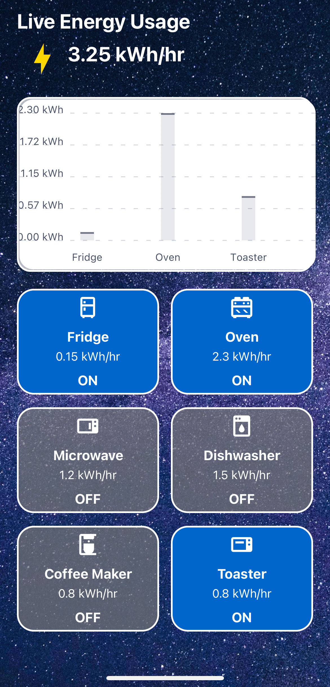

# Windash - Energy Monitoring Solution

Windash is an innovative React Native application designed to monitor and track household energy consumption. By providing real-time data insights, predictive analytics, and interactive reports, Windash empowers users to optimize their energy usage, save costs, and contribute to a greener environment.

## Table of Contents

1. [Features](#features)
2. [Snapshots](#snapshots)
3. [Installation](#installation)
4. [Usage](#usage)
5. [Screens Overview](#screens-overview)
6. [Technology Stack](#technology-stack)
7. [License](#license)
8. [Troubleshooting](#troubleshooting)

---

## Features

- **Real-time Energy Tracking**: Monitor live energy usage across different rooms and appliances.
- **Predictive Insights**: Utilize AI and machine learning to forecast future energy consumption.
- **Interactive Dashboard**: Visualize energy data through intuitive charts and graphs.
- **Customizable Reports**: Generate detailed reports tailored to your household setup.
- **Interactive Alerts**: Receive notifications when energy usage exceeds predefined thresholds.
- **Bill Estimation**: Estimate monthly electricity bills based on current usage trends.
- **Engaging UI**: A flower pot visual on the home screen provides a quick overview of energy performance.

---

## Snapshots

Here are some screenshots showcasing the Windash application in action:

### 1. **Login Screen**

The login screen allows users to securely sign in to the Windash app using their credentials. It serves as the gateway to the application’s features.

---

### 2. **Profile Setup Screen**

The profile setup screen helps users define their household environment by selecting the number of rooms, household type (apartment/condo), and energy sources (solar, oil, electricity).

---

### 3. **FlowerOne Dashboard**

The FlowerOne screen provides a visual representation of household energy usage, using a flower pot metaphor to display the most vital information about energy consumption across the house.

---

### 4. **Flowerpot Detailed Dashboard**

This detailed dashboard allows users to monitor individual room energy usage, track live energy data, and explore further energy statistics for each appliance or space in the household.

---

### 5. **Live Energy Usage**

The live energy usage screen captures real-time data for all connected devices, showing users the exact energy being consumed at any given moment within the household.

---

### 7. **Energy Usage Screen**

The energy usage screen provides detailed insights into daily, weekly, and monthly energy consumption. Users can analyze their energy usage patterns and make informed decisions to optimize energy savings.

---

### 6. **Bill Estimation Screen**

The bill estimation screen helps users predict their monthly energy bills based on the real-time and historical energy usage trends tracked by the app.

---

## Installation

### Prerequisites

Before you begin, ensure you have met the following requirements:

- **Node.js**: Version 14.x or higher. [Download Node.js](https://nodejs.org/)
- **React Native** :For Mobile Apps.(https://reactnative.dev/docs/environment-setup)
- **Expo**: For mobile device emulation(https://expo.dev/go).
- **Git**: For cloning the repository. [Download Git](https://git-scm.com/)
- **IDE**: Visual Studio Code is recommended. [Download VS Code](https://code.visualstudio.com/)

### Step-by-Step Installation

 - Step 1: download node.js from https://nodejs.org/en/download/package-manager
 - Step 2: download visual studio app
 - Step 3: download the code base from github
    click green "code" button and download ZIP file
 - Step 4: unzip all
 - Step 5: open the folder DECO3801 with visual studio code
 - Step 6: open terminal in visual studio code

 - Step 7: run the following command in terminal 
 - npm install -g yarn
 - yarn add expo
 - yarn expo start

now a QR code should be generated

 - Step 8: download `expo` app from your mobile device (android/ios)
 - Step 9: open the app and click `Scan QR code` and scan the generated QR cdoe from `npm start`

Now the project will be built on your mobile device

## Technology Stack

- **Frontend**: React Native
- **State Management**: Redux or Context API
- **Backend**: Mongodb or Node.js
- **AI/ML**: TensorFlow, scikit-learn for trend analysis
- **Data Visualization**: Victory Native or React Native Charts
- **Database**: MongoDb for storing user data and energy reports

---

## License

This project is licensed under the MIT License - see the [LICENSE](LICENSE) file for details.

---

## Troubleshooting

- **App not starting on Android**: Ensure your emulator is running, and the device is connected and authorized for debugging.
- **App not running on iOS**: Make sure Xcode/Expo is installed and the project is configured properly.

